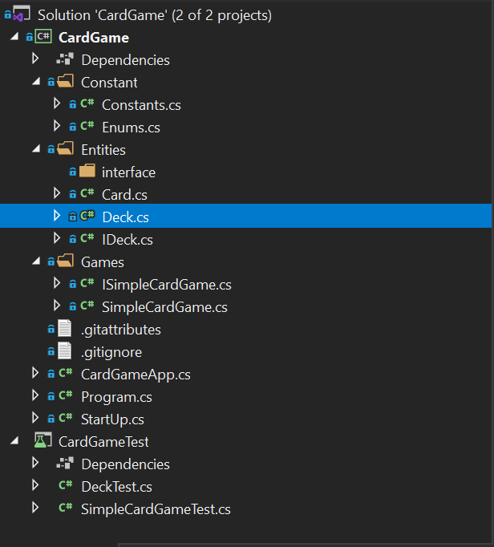

# CardGame
Design and implemantation of extendable solution simple card game.

Tech stack.
Dotnet core.
Xunit

Feature in card game.
1 - Shuffle the card.
2 - Draw the card of deck.
3 - Restart the game.

This soluiton also have unit testing done for the project.

